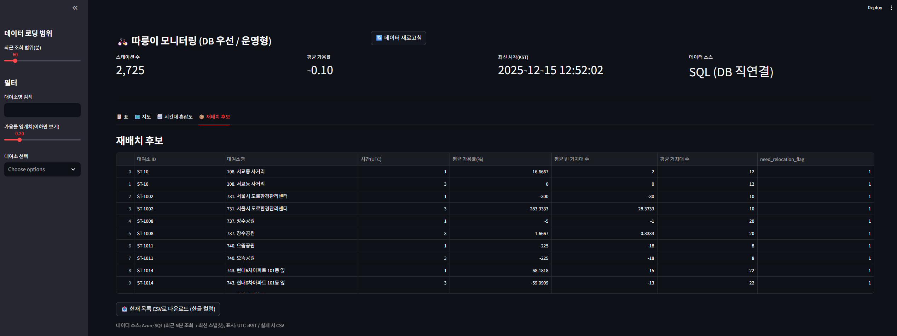
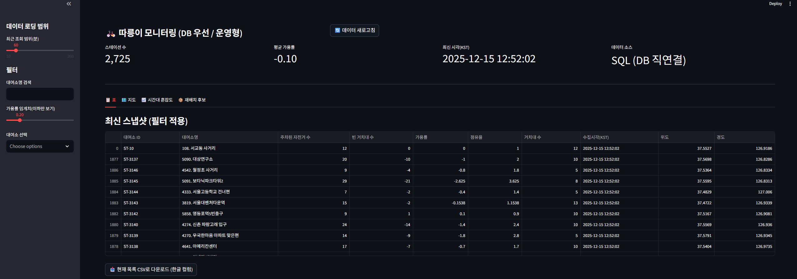
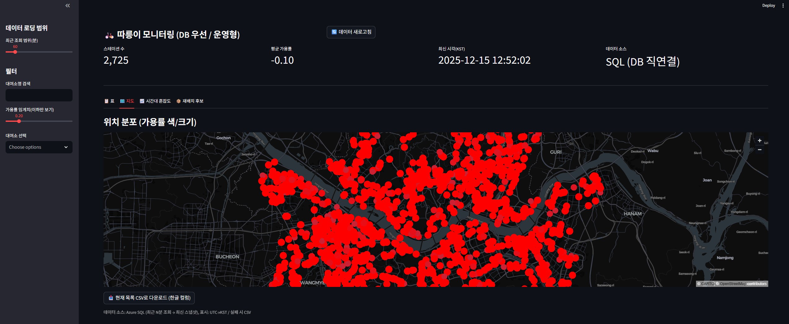
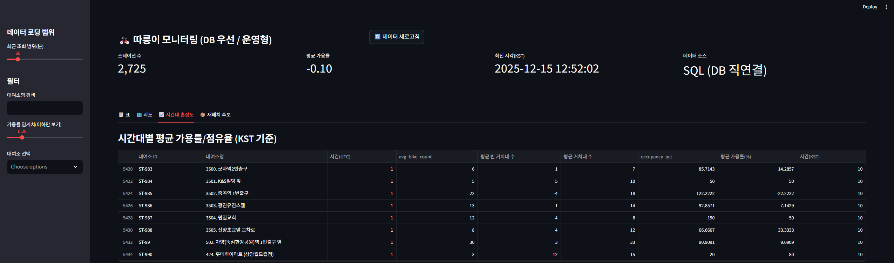
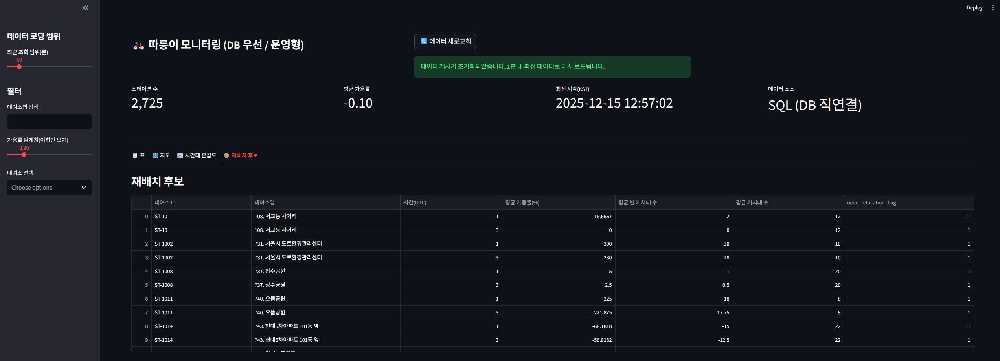
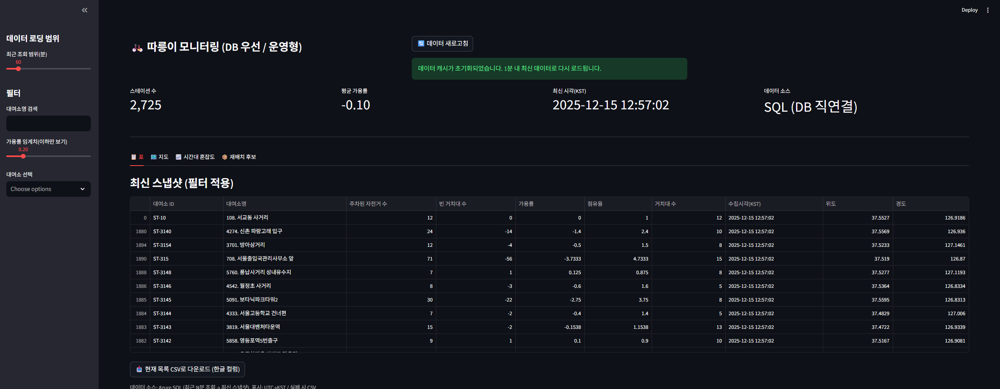
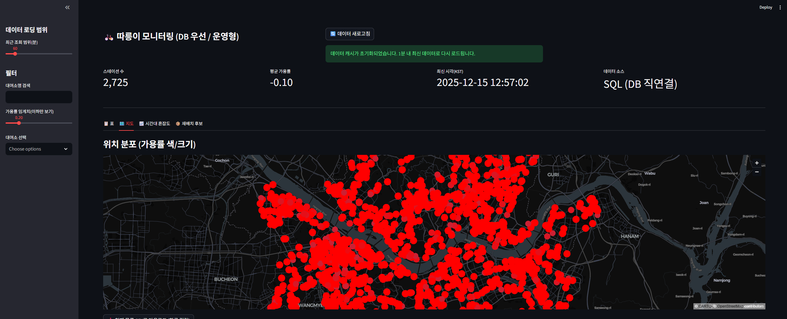
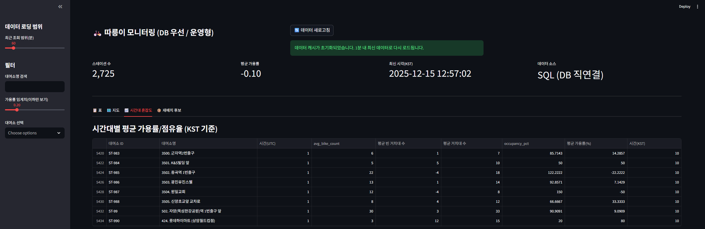

# 🚲 서울 따릉이 실시간 모니터링 시스템 (Azure 기반)

## 1️⃣ 프로젝트 개요

서울시 공공데이터(따릉이 API)를 활용하여
실시간 데이터 수집 → Raw 저장 → ETL 적재 → 분석 → 대시보드 시각화까지
Azure 클라우드 환경에서 End-to-End로 구현한 데이터 파이프라인 프로젝트입니다.

본 프로젝트는 단순 시각화가 아닌,
운영을 고려한 수집·적재·장애 대응 구조 설계 경험에 초점을 두었습니다.

## 2️⃣ 전체 아키텍처

[서울시 API]

      ↓
      
[Azure Functions - Timer Trigger (5분)]

      ↓
      
[Azure Blob Storage (Raw JSON)]

      ↓
      
[Azure Data Factory (ETL)]

      ↓
      
[Azure SQL Database]

      ↓
      
[Streamlit Dashboard]

🔹 구성 요소

Azure Functions

5분 간격 Timer Trigger

API 호출 후 Raw JSON을 Blob Storage에 저장

Azure Blob Storage

raw/yyyy/MM/dd/HH/*.json 구조로 저장

원본 데이터 보존 (재처리 가능 구조)

Azure Data Factory

Blob → Azure SQL ETL 파이프라인

JSON Path 매핑 ($.rentBikeStatus.row)

Azure SQL Database

정제된 데이터 저장

분석용 View 구성

Streamlit

실시간 가용률, 혼잡도, 재배치 후보 시각화

## 3️⃣ 데이터 파이프라인 상세
1단계 — 데이터 수집 (Ingestion)

수집 주기: 5분

대상: 서울시 전체 대여소 (약 2,700개)

Azure Functions Timer Trigger 기반 자동 실행

JSON 원본을 Blob Storage에 시간 기준 디렉토리 구조로 저장

2단계 — ETL (Blob → SQL)

Azure Data Factory Copy Activity 사용

JSON Path: $.rentBikeStatus.row

주요 매핑 컬럼:

컬럼	설명
station_id	대여소 ID
station_name	대여소 이름
rack_tot_cnt	전체 거치대 수
parking_bike_tot_cnt	현재 자전거 수
lat, lon	위치 정보
ts_utc	수집 시각

SQL에서 계산 컬럼 추가:

slots_available

utilization_rate

3단계 — 데이터 모델링
📌 주요 테이블
bike_status

복합 PK: (station_id, ts_utc)

스냅샷 기반 시계열 구조

📌 주요 View

vw_latest_bike_status

각 대여소의 최신 상태 조회

vw_station_utilization

이용률(가용률) 계산

vw_hotspots_latest

가용률 임계치 이하 대여소 추출

## 4️⃣ 대시보드 구성 (Streamlit)
주요 기능

전체 대여소 현황 테이블

지도 시각화 (위도/경도 기반)

시간대별 혼잡도 분석

재배치 필요 후보 대여소 목록

운영 설계

DB 우선 조회

DB 실패 시 CSV fallback 모드

Streamlit cache 활용하여 조회 성능 개선

## 5️⃣ Results (정량 성과)

수집 주기: 5분 자동 실행

대상 규모: 약 2,700개 대여소

Raw JSON 저장 구조: 시간 기준 계층 저장

Azure SQL 적재 성공 (ETL 파이프라인 검증 완료)

End-to-End 흐름:
API → Functions → Blob → ADF → SQL → Streamlit

## 6️⃣ 실행 방법 (로컬 테스트 기준)
1. Azure Functions 실행
```
cd azure_func
func start
```

2. Streamlit 실행
```
cd app
streamlit run app.py
```

3. 필요 환경 변수 (.env 예시)
```
SEOUL_BIKE_API_KEY=...
STORAGE_CONN_STR=...
SQL_SERVER=...
SQL_DATABASE=...
SQL_USERNAME=...
SQL_PASSWORD=...
```

## 7️⃣ 장애 및 개선 경험
🔹 문제

JSON 매핑 오류 (dataset() invalid)

NULL insert 오류

인코딩 문제 (station_name 한글 깨짐)

트리거 비용 증가 우려

🔹 해결

JSON Path 명확화

NVARCHAR로 스키마 수정

트리거 수동 전환 후 비용 통제

Blob 원본 저장 구조 유지로 재처리 가능 설계

## 8️⃣ 배운 점

클라우드 서비스 간 연결 구조 설계 경험

Raw zone → ETL → Serving 구조 이해

데이터 정합성과 운영 안정성의 중요성 체감

비용/자동화/장애 대응까지 고려한 파이프라인 설계

## 9️⃣ 개선 아이디어

Data Quality 체크 자동화

ADF 트리거 완전 자동화

Power BI 연동

비용 모니터링 대시보드 추가

## 📸 스크린샷
### 🔹 12:52 기준 (데이터 수집 직후)





### 🔹 12:57 기준 (5분 후 자동 갱신)





